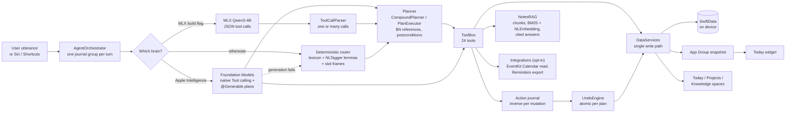

<p align="center">
  
</p>

# PocketBrains

**A private chief of staff for your tasks, projects and notes, run by an
AI agent that lives entirely on your iPhone.** Say what you need in one
thread; a 24-tool agent plans multi-step requests, acts on a local
SwiftData store, answers questions from your notes with citations, and
can undo anything it did, using Apple's on-device model, an optional open
model, or a deterministic parser when neither is available. Nothing leaves
the phone.

[](https://github.com/seanmcrae/pocketbrains-app/actions/workflows/ci.yml)


## In 60 seconds

- **Product bet:** the people who most need an AI assistant for their
  work (consultants under NDA, founders, leads juggling workstreams) are
  often the ones who cannot put that work into a cloud chatbot. iOS 26's
  on-device model makes a useful assistant possible without that trade.
- **What it does:** "create a project Launch, add 3 tasks for Friday and
  link it to brand voice" runs as a visible five-step plan; "what do my
  notes say about the venue?" answers with `[1]` citations to the source
  notes; "remind me to take out the bins every other Thursday" creates a
  recurring task; "undo that" reverts the whole last request. Each step is
  a tool call against real structured data, not a chat reply.
- **How it stays reliable:** a three-tier brain. Apple Foundation Models
  with native tool calling and guided-generation plans, an optional MLX
  build running Qwen3-4B, and a deterministic planner and router that
  always work, so the product never shows "AI unavailable". Every
  mutation is journaled with its inverse, so every action is undoable.
- **How it is measured:** a reproducible eval of 139 synthetic utterances
  runs on every CI build. The deterministic floor scores **100%
  end-to-end on canonical and multi-step phrasing** (gated),
  **97.5% on the original 40-utterance corpus** (77.5% in v0.1), and
  **35.3% on a held-out paraphrase split** it was never tuned on. That
  last number is the honest measure of the floor, and the gap the
  language-model tiers exist to close.
- **Product docs:** [docs/PRODUCT.md](docs/PRODUCT.md) has the problem,
  users, jobs to be done, metrics, local-versus-cloud trade-offs, decisions
  and roadmap.

> Screenshots from a device are not yet in the repository; see
> [Screenshots](#screenshots).

## Architecture



Every brain emits the same event stream (tool started, tool finished,
text snapshot, done); plans use it too, as a plan card that updates in
place plus numbered step cards, so the UI never knows which brain
answered. If a model reports itself available but fails to generate, the
orchestrator swaps to the deterministic router and answers the same
prompt. Agent, views, Siri intents and the widget feed all go through one
service layer. Details: [docs/ARCHITECTURE.md](docs/ARCHITECTURE.md).

## Why on-device

| | On-device (PocketBrains) | Cloud assistant |
|---|---|---|
| Client and personal data | Never leaves the phone | Sent to a provider |
| Works offline / Airplane Mode | Yes | No |
| Per-request cost | None, no backend | Per token |
| Reasoning headroom | Smaller model, so its job is kept small: pick a tool, fill arguments | Large models, long context |
| Device coverage | Apple Intelligence devices, plus MLX and deterministic tiers | Any connected device |

The design keeps the model's job narrow and puts the data work in
deterministic, tested code. That is what makes a ~3B on-device model
sufficient for this product.

## Features

- **One thread as home.** Natural-language capture and questions; tool
  activity renders as inline cards so every action is visible.
- **Multi-step plans.** One request becomes an ordered plan of tool calls
  with results passed between steps (a project created in step 1 is the
  one step 3 files tasks into, by id). Each step's postcondition is
  checked; the first failure stops the plan with a clear message.
- **Undo for everything the agent does.** Each mutation records its
  inverse in an on-device journal. Tap Undo on a card, or say "undo that"
  to revert the last request, a whole plan atomically.
- **Ask your notes.** Questions are answered from your own notes with
  inline `[n]` citations; tap a source chip to open the note. Hybrid
  retrieval (BM25 plus on-device sentence embeddings) over overlapping
  passages, kept incremental as notes change.
- **Recurring tasks, rescheduling, snoozing, priorities, milestones.**
  "Every other Monday", "push the report to end of month", "snooze the
  gutters for 3 days".
- **Opt-in system integrations.** Calendar context for briefs and "what's
  my afternoon look like?", export of tasks to Apple Reminders (undoable),
  both off until switched on in Settings, Integrations.
- **Siri, Shortcuts and a Today widget.** Ask PocketBrains, Add Task,
  What's Blocking a project; a widget with the brief and next tasks.
- **Spaces.** Pull the thread down and it docks while Today (ranked
  agenda), Projects (progress, blockers, milestones, activity) and
  Knowledge (an orbital constellation of linked notes) fan in. One scalar
  drives the whole transition, so it is gestural and interruptible.
- **Knowledge graph.** Typed links between notes, tasks and projects;
  new notes are linked automatically to the projects and tasks they name.
- **Semantic note search** with on-device sentence embeddings, merged
  with keyword search.
- **Rituals.** A morning brief and an evening reflection composed from
  your data; due-date notifications kept in sync with tasks.
- **Full JSON export.**
- **Deep Glass design system.** Metal shaders for SDF refraction with a
  motion-tracked specular, aurora noise for the agent's presence, and a
  per-glyph "condensation" reveal for streaming text via a custom
  `TextRenderer`. Reduce Motion freezes the living surfaces. See
  [docs/DESIGN.md](docs/DESIGN.md).
- **Privacy manifest** declaring no tracking and no collected data.

## The 24 tools

One implementation (`ToolBox`) serves all three brains: bridged to native
Foundation Models `Tool`s with `@Generable` arguments, rendered into a
JSON tool prompt for MLX, and called by the deterministic router. Every
mutating tool records its inverse in the action journal. Examples show
what each tool is for; the deterministic router's exact grammar is the
canonical split of the eval.

| Tool | What it does | Example request |
|---|---|---|
| `createTask` | Task with natural due date, priority, project, optional repeat rule | "Remind me to take out the bins every other Thursday" |
| `completeTask` | Complete a task; a recurring one spawns its next occurrence | "Finish book flights" |
| `updateTask` | Change due date, priority or project | "Move the budget draft into Q3 Planning" |
| `rescheduleTask` | New date, or a shift from the current one | "Reschedule the quarterly report to end of month" |
| `snoozeTask` | Push a task out from today | "Snooze clean the gutters for 3 days" |
| `setPriority` | Low, normal, high, urgent | "Make the quarterly report urgent" |
| `setRecurrence` | Daily, weekdays, every N weeks or days, or stop | "Make clean the gutters repeat every week" |
| `queryTasks` | Today, overdue, blocked, upcoming or all | "Which tasks are overdue?" |
| `createProject` | Create a project | "New project called Kitchen renovation" |
| `projectStatus` | Progress, blockers and what they wait on, milestones | "What's blocking the website redesign?" |
| `addMilestone` | Add a dated milestone | "Add milestone Public beta to Q3 Planning by end of month" |
| `listMilestones` | A project's milestones, soonest first | "What milestones does website redesign have?" |
| `createNote` | Capture a note; auto-link it to what it mentions | "Note: the vendor prefers invoices as PDF" |
| `appendNote` | Add text to an existing note | "Append to meeting notes: Sam will send the deck" |
| `askNotes` | Answer from your notes with `[n]` citations | "What do my notes say about the venue?" |
| `searchNotes` | Semantic plus keyword note search | "Find notes about pricing" |
| `searchEverything` | Tasks, projects and notes at once | "Search everything for invoice" |
| `notesFrom` | Notes from a given day | "Summarize my notes from yesterday" |
| `linkItems` | Typed link between any two items | "Link brand voice to website redesign" |
| `agenda` | Overdue, due today, blocked, this week | "What needs my attention today?" |
| `calendarAgenda` | Calendar events in a window plus tasks due (opt-in) | "What's my afternoon look like?" |
| `exportToReminders` | Copy tasks into Apple Reminders (opt-in, undoable) | "Export today's tasks to Reminders" |
| `recall` | Search past conversation and completed work | "When did I book flights?" |
| `undo` | Revert the last request (whole plan) or only the last action | "Undo that" |

The agent still has no delete tools, by design: a misread request or
injected note content cannot destroy data, and anything it creates or
changes can be undone.

## Evaluation

`Tests/Eval` runs every utterance in a **synthetic** corpus (written for
the eval; no real user data) through the deterministic brain's real entry
point (`IntentFallbackBackend.routeTurn`, which plans compound requests)
against a freshly seeded in-memory store, and scores tool choice (for
compound requests, the exact tool sequence) and end-to-end correctness
(every call succeeded and the resulting state is right: title, due date,
priority, repeat rule, completion, filing, note text). It runs on every CI
build and prints its table to the job summary.

The corpus has 139 utterances in five splits. The **original 40** (v0.1)
keep their exact utterances and expectations. v0.2 adds **canonical**
phrasing for the new tools (30), **compound** multi-step requests (12),
**dev paraphrases** the router may be tuned on (23), and a **held-out**
paraphrase split (34) that was committed before any v0.2 router work and
never used to tune rules; its misses are counted but not printed, so they
cannot leak into rule-writing. Caveat: the same author wrote the held-out
set and the rules, so it is less independent than user data would be.

Results from CI on the iPhone 17 Pro simulator, Xcode 26.6
(tool accuracy / end-to-end):

| Split | n | v0.1 router ([run 37644353241](https://github.com/seanmcrae/pocketbrains-app/actions/runs/37644353241)) | Before router upgrade ([run 37650929852](https://github.com/seanmcrae/pocketbrains-app/actions/runs/37650929852)) | v0.2 ([run 37652691087](https://github.com/seanmcrae/pocketbrains-app/actions/runs/37652691087)) |
|---|---|---|---|---|
| Original canonical | 29 | 100% / 100% | 100% / 100% | **100% / 100%** |
| Original paraphrase | 11 | 18.2% / 18.2% | 18.2% / 18.2% | **90.9% / 90.9%** |
| Original 40, overall | 40 | 77.5% / 77.5% | 77.5% / 77.5% | **97.5% / 97.5%** |
| v0.2 canonical | 30 | n/a | 36.7% / 20.0% | **100% / 100%** |
| v0.2 compound | 12 | n/a | 58.3% / 58.3% | **100% / 100%** |
| v0.2 dev paraphrase | 23 | n/a | 0% / 0% | **100% / 100%** |
| v0.2 held-out paraphrase | 34 | n/a | 11.8% / 11.8% | **38.2% / 35.3%** |
| All | 139 | n/a | 38.1% / 34.5% | **84.2% / 83.5%** |

"Before router upgrade" is the v0.2 branch with the multi-step planner and
the new tools already in place, but the v0.1 grammar and date parser; it
isolates what the lexicon, lemma and slot-frame work bought. The one
remaining miss on the original 40 is "Push send the invoice to Monday",
which v0.2 routes to the new `rescheduleTask` rather than the expected
`updateTask`; the task does move to Monday, but the expectation is kept
as written.

The gate: every canonical and compound case (71) must pass end to end, or
CI fails. Paraphrase splits are reported, not gated.

Routing plus tool execution latency on the CI simulator (in-memory
store), from the v0.2 run: p50 6.8 ms, p95 25.7 ms (v0.1 baseline run:
p50 2.5 ms, p95 7.3 ms). The increase comes from NLTagger tokenization and
lemmatization; latency varies between runner instances, while accuracy is
deterministic.

"Ask your notes" retrieval on its own 12-question synthetic corpus, BM25
path (the test host has no embedding asset): recall@1 91.7%, recall@3
91.7%. The miss is a vocabulary-mismatch question ("how should our copy
sound?" for a note on brand voice) that the embedding half of the hybrid
is there to catch on device.

What this eval does **not** measure: the Foundation Models and MLX brains,
including their planning. They need Apple Intelligence hardware or the
MLX build, so no model accuracy or latency numbers are claimed here.

## Build and run

Requirements: a Mac with Xcode 26 (iOS 26 SDK) and
[XcodeGen](https://github.com/yonaskolb/XcodeGen). The Xcode project is
generated from `project.yml` and is not committed.

```bash
brew install xcodegen
git clone https://github.com/seanmcrae/pocketbrains-app.git
cd pocketbrains
xcodegen generate
open PocketBrains.xcodeproj
```

Run on an iOS 26 simulator or device. On hardware with Apple Intelligence
the Foundation Models brain engages automatically; elsewhere, including
the simulator, the deterministic router answers. Settings, Intelligence
lets you force the deterministic brain. Calendar and Reminders stay off
until you enable them in Settings, Integrations. The Today widget builds
unsigned in CI; to run it on a device, sign both the app and
`PocketBrainsWidget` with your team and keep the App Group
`group.com.pocketbrains.shared` on both (declared in `project.yml`). To
build the optional MLX backend,
follow the comments in `project.yml` (adds the mlx-swift-examples package
and the `POCKETBRAINS_MLX` flag; the model is a ~2.3 GB download on first
use).

Tests, exactly as CI runs them:

```bash
xcodebuild test -project PocketBrains.xcodeproj -scheme PocketBrains \
  -destination 'platform=iOS Simulator,name=iPhone 17 Pro' \
  -parallel-testing-enabled NO CODE_SIGNING_ALLOWED=NO
```

## Tests and CI

112 Swift Testing tests in 15 suites (v0.1: 55 in 10, per the CI logs)
cover natural-language date parsing (against now and a fixed reference
date), every `ToolBox` operation, the tool registry and the prompted
tool-call parser, planning, argument passing, failure handling and undo,
chunking, BM25 recall@k, citation mapping and incremental indexing,
EventKit mapping behind mocks, the widget snapshot, recurrence, intent
routing, the knowledge-graph layout, the streaming text clock, a SwiftData
regression walk for iOS 26 runtime traps, and the eval.

[CI](.github/workflows/ci.yml) runs on every pull request and push to
`main`: a Linux job scans the tree for home-directory paths, credentials
and large files ([scripts/check-hygiene.sh](scripts/check-hygiene.sh)),
then a `macos-26` job generates the project (app, Today widget extension
and tests) and runs the full suite on an iPhone simulator with the newest
installed Xcode.

## Limitations

- **Not released.** No App Store build, no users, no telemetry. The app
  has been run on the iOS 26 simulator; the Foundation Models path,
  including guided-generation planning, has not been verified on device in
  this repository (see [docs/VERIFICATION.md](docs/VERIFICATION.md)).
- **The deterministic floor is still rigid off-grammar.** 35.3% end to
  end on held-out paraphrases. Compound splitting only happens before a
  command verb, and "next Tuesday" means the coming Tuesday.
- **Tool budget on the ~3B model.** Foundation Models sees 22 tools (24
  with both integrations on). That is a lot of schema for a small context
  window; trimming per request is on the roadmap.
- **Integrations are untested on device.** EventKit is covered by mapping
  tests behind protocols; the permission flows, Siri phrases and the
  widget need a device or simulator run by hand. The widget needs the App
  Group capability when signed.
- **MLX is opt-in and not compiled in CI.** Its tool-call parser,
  including multi-call plans, is tested.
- **English only**, fixed type sizes (Dynamic Type mapping is pending),
  and the VoiceOver pass is incomplete.
- **Semantic search and passage embeddings** are brute-force cosine over a
  personal-scale corpus and are disabled under the test host, so tests
  cover the keyword path.
- Open engineering items are tracked in [docs/QA_REPORT.md](docs/QA_REPORT.md).

## Screenshots

Device captures are still to be added. The intended set: a multi-step
plan card mid-run, Undo on a plan card, a cited "ask your notes" answer
with source chips, the Integrations permission screen, the Today widget,
the pull-down zoom into spaces, a project dossier with blockers, the
Knowledge constellation, and the in-app privacy receipt.

## Roadmap

Now: run the 139-utterance eval on the Foundation Models brain on device
(single-step and planned), publish tool-call accuracy and time to first
token; trim the tool list per request. Next: Dynamic Type, VoiceOver,
localization, an interactive widget. Later: opt-in private iCloud sync.
Full roadmap and success metrics in [docs/PRODUCT.md](docs/PRODUCT.md).

## Repository layout

```
Sources/
  App/            entry point, app model, thread/spaces shell, App Intents
  Agent/          ToolBox, registry, orchestrator, undo, dates, briefs
    Planner/      CompoundPlanner, PlanExecutor, plan model
    Router/       IntentGrammar, CommandFrames, Lexicon
  Intelligence/   ModelBackend protocol, Foundation Models / MLX / fallback, embeddings
    Retrieval/    NoteChunker, BM25, NotesRAG (cited answers)
  Integrations/   EventKit bridge behind protocols, widget snapshot publisher
  Data/           SwiftData models, journal, recurrence, services (single write path), store
  DesignSystem/   tokens, Deep Glass material, components, haptics, motion light
  Shaders/        LiquidGlass.metal: glass, aurora, specular sweep
  Features/       Thread, Today, Projects, Knowledge, Spaces, Settings, Privacy
Shared/           code compiled into both the app and the widget (WidgetSnapshot)
Widget/           Today widget extension (WidgetKit)
Tests/            unit tests; Eval/ holds the synthetic corpus and eval harness
docs/             PRODUCT, ARCHITECTURE, DESIGN, VERIFICATION, LAUNCH, QA_REPORT
```

## Contributing and security

See [CONTRIBUTING.md](CONTRIBUTING.md) and [SECURITY.md](SECURITY.md).
Changes are logged in [CHANGELOG.md](CHANGELOG.md).

## License

No license has been chosen yet, so all rights are reserved by default and
the code is published for review only. PocketBrains is intended as a
commercial app; a license will be added once that decision is made.

Built by [Sean McRae](https://github.com/seanmcrae).
