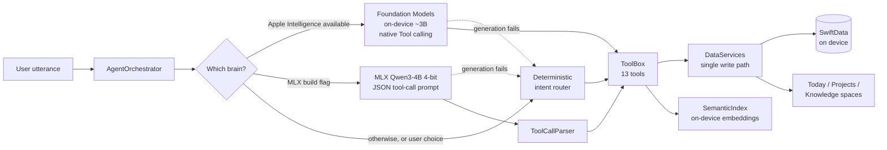

<p align="center">
  
</p>

# PocketBrains

**A private chief of staff for your tasks, projects and notes, run by an
AI agent that lives entirely on your iPhone.** Say what you need in one
thread; a 13-tool agent acts on a local SwiftData store, using Apple's
on-device model, an optional open model, or a deterministic parser when
neither is available. Nothing leaves the phone.

[](https://github.com/seanmcrae/pocketbrains-app/actions/workflows/ci.yml)


## In 60 seconds

- **Product bet:** the people who most need an AI assistant for their
  work (consultants under NDA, founders, leads juggling workstreams) are
  often the ones who cannot put that work into a cloud chatbot. iOS 26's
  on-device model makes a useful assistant possible without that trade.
- **What it does:** "remind me to send the invoice Friday", "what's
  blocking the website redesign?", "summarize my notes from yesterday",
  "link brand voice to the website". Each request becomes a visible tool
  call against real structured data, not a chat reply.
- **How it stays reliable:** a three-tier brain. Apple Foundation Models
  with native tool calling, an optional MLX build running Qwen3-4B, and a
  deterministic router that always works, so the product never shows
  "AI unavailable".
- **How it is measured:** a reproducible tool-calling eval runs on every
  CI build. On the bundled synthetic corpus the deterministic floor scores
  **100% tool accuracy on canonical phrasing** and
  **18.2% on paraphrases**, which is exactly the gap the language
  model tiers exist to close.
- **Product docs:** [docs/PRODUCT.md](docs/PRODUCT.md) has the problem,
  users, jobs to be done, metrics, local-versus-cloud trade-offs, decisions
  and roadmap.

> Screenshots from a device are not yet in the repository; see
> [Screenshots](#screenshots).

## Architecture



Every brain emits the same event stream (tool started, tool finished,
text snapshot, done), so the UI never knows which one answered. If a model
reports itself available but fails to generate, the orchestrator swaps to
the deterministic router and answers the same prompt. Agent, views and
Siri intents all write through one service layer, so anything the agent
does appears in the spaces immediately. Details:
[docs/ARCHITECTURE.md](docs/ARCHITECTURE.md).

## Why on-device

| | On-device (PocketBrains) | Cloud assistant |
|---|---|---|
| Client and personal data | Never leaves the phone | Sent to a provider |
| Works offline / Airplane Mode | Yes | No |
| Per-request cost | None, no backend | Per token |
| Reasoning headroom | Smaller model, so its job is kept small: pick a tool, fill arguments | Large models, long context |
| Device coverage | Apple Intelligence devices, plus MLX and deterministic tiers | Any connected device |

The design keeps the model's job narrow and puts the data work in
deterministic, tested code. That is what makes a ~3B on-device model
sufficient for this product.

## Features

- **One thread as home.** Natural-language capture and questions; tool
  activity renders as inline cards so every action is visible.
- **Spaces.** Pull the thread down and it docks while Today (ranked
  agenda), Projects (progress, blockers, milestones, activity) and
  Knowledge (an orbital constellation of linked notes) fan in. One scalar
  drives the whole transition, so it is gestural and interruptible.
- **Knowledge graph.** Typed links between notes, tasks and projects;
  new notes are linked automatically to the projects and tasks they name.
- **Semantic note search** with on-device sentence embeddings, merged
  with keyword search.
- **Rituals.** A morning brief and an evening reflection composed from
  your data; due-date notifications kept in sync with tasks.
- **Siri and Shortcuts** capture, and **full JSON export**.
- **Deep Glass design system.** Metal shaders for SDF refraction with a
  motion-tracked specular, aurora noise for the agent's presence, and a
  per-glyph "condensation" reveal for streaming text via a custom
  `TextRenderer`. Reduce Motion freezes the living surfaces. See
  [docs/DESIGN.md](docs/DESIGN.md).
- **Privacy manifest** declaring no tracking and no collected data.

## The 13 tools

One implementation (`ToolBox`) serves all three brains: bridged to native
Foundation Models `Tool`s with `@Generable` arguments, rendered into a
JSON tool prompt for MLX, and called directly by the deterministic router.

| Tool | What it does | Example request |
|---|---|---|
| `createTask` | Create a task with natural due date, priority, project | "Remind me to send the invoice Friday" |
| `completeTask` | Complete a task matched by title words | "Finish book flights" |
| `updateTask` | Change due date, priority or project | "Make the budget draft urgent" |
| `queryTasks` | Today, overdue, blocked, upcoming or all | "What's blocked?" |
| `createProject` | Create a project | "New project called Kitchen renovation" |
| `projectStatus` | Progress, blockers and what they wait on, milestones | "What's blocking the website redesign?" |
| `addMilestone` | Add a dated milestone | "Add a Beta milestone to the website for June 30" |
| `createNote` | Capture a note; auto-link it to what it mentions | "Note: the vendor prefers invoices as PDF" |
| `searchNotes` | Semantic plus keyword search | "Find notes about pricing" |
| `notesFrom` | Notes from a given day | "Summarize my notes from yesterday" |
| `linkItems` | Typed link between any two items | "Link brand voice to website redesign" |
| `agenda` | Overdue, due today, blocked, this week | "What needs my attention today?" |
| `recall` | Search past conversation and completed work | "When did I book flights?" |

The agent has no delete tools, by design: a misread request or injected
note content cannot destroy data.

## Evaluation

`Tests/Eval` runs every utterance in a **synthetic** 40-item corpus
(written for the eval; no real user data) through the deterministic router
against a freshly seeded in-memory store, and scores tool choice and
end-to-end correctness (right tool, tool succeeded, title, due date and
completed task as expected). It runs on every CI build and prints its
table to the job summary.

Results on the bundled synthetic corpus, from CI run
[CI](https://github.com/seanmcrae/pocketbrains-app/actions/workflows/ci.yml) (iPhone 17 Pro simulator, Xcode 26.6):

| Split | n | Tool accuracy | End-to-end |
|---|---|---|---|
| Canonical phrasing | 29 | 100% | 100% |
| Paraphrase | 11 | 18.2% | 18.2% |
| Overall | 40 | 77.5% | 77.5% |

Routing plus tool execution latency on the CI simulator (in-memory
store): p50 2.1 ms, p95 4.5 ms. Latency varies between runner
instances (the baseline run measured p50 3.6 ms, p95 13.5 ms); accuracy
is deterministic.

How the numbers were used: the baseline run (canonical 93.1% tool
accuracy, 89.7% end-to-end; paraphrase 9.1%) exposed three routing bugs,
such as "remind me to *finish* the deck by Thursday" completing a task
instead of creating one, and "in 3 days" leaking into task titles. The fix
took canonical phrasing to 100%, and canonical misses now fail CI. The
paraphrase gain (9.1% to 18.2%) is one case, "notes about pricing", fixed
by tightening the note-capture prefix. Paraphrases are reported but deliberately not tuned against: adding
rules until they pass would overfit 11 sentences, and paraphrase is the
language model's job.

What this eval does **not** measure: the Foundation Models and MLX brains.
They need Apple Intelligence hardware or the MLX build, so no model
accuracy or latency numbers are claimed here. Running this corpus on
device is first on the roadmap.

## Build and run

Requirements: a Mac with Xcode 26 (iOS 26 SDK) and
[XcodeGen](https://github.com/yonaskolb/XcodeGen). The Xcode project is
generated from `project.yml` and is not committed.

```bash
brew install xcodegen
git clone https://github.com/seanmcrae/pocketbrains-app.git
cd pocketbrains
xcodegen generate
open PocketBrains.xcodeproj
```

Run on an iOS 26 simulator or device. On hardware with Apple Intelligence
the Foundation Models brain engages automatically; elsewhere, including
the simulator, the deterministic router answers. Settings, Intelligence
lets you force the deterministic brain. To build the optional MLX backend,
follow the comments in `project.yml` (adds the mlx-swift-examples package
and the `POCKETBRAINS_MLX` flag; the model is a ~2.3 GB download on first
use).

Tests, exactly as CI runs them:

```bash
xcodebuild test -project PocketBrains.xcodeproj -scheme PocketBrains \
  -destination 'platform=iOS Simulator,name=iPhone 17 Pro' \
  -parallel-testing-enabled NO CODE_SIGNING_ALLOWED=NO
```

## Tests and CI

55 Swift Testing tests in 10 suites cover natural-language
date parsing (against now and a fixed reference date), every `ToolBox`
operation, the tool registry and the prompted tool-call parser, intent
routing, the knowledge-graph layout, the streaming text clock, a SwiftData
regression walk for iOS 26 runtime traps, and the eval.

[CI](.github/workflows/ci.yml) runs on every pull request and push to
`main`: a Linux job scans the tree for home-directory paths, credentials
and large files ([scripts/check-hygiene.sh](scripts/check-hygiene.sh)),
then a `macos-26` job generates the project and runs the full suite on an
iPhone simulator with the newest installed Xcode.

## Limitations

- **Not released.** No App Store build, no users, no telemetry. The app
  has been run on the iOS 26 simulator; the Foundation Models path has not
  been verified on device in this repository (see
  [docs/VERIFICATION.md](docs/VERIFICATION.md) for the API hedges).
- **The deterministic floor is rigid.** It handles the documented
  phrasings well and most paraphrases poorly (see Evaluation). It also has
  no rules for rescheduling or milestones; those need a model tier.
- **MLX is opt-in and not compiled in CI.** Only its tool-call parser is
  tested.
- **English only**, fixed type sizes (Dynamic Type mapping is pending),
  and the VoiceOver pass is incomplete.
- **Semantic search** is brute-force cosine over a personal-scale corpus,
  and is disabled under the test host, so tests cover keyword search.
- Open engineering items are tracked in [docs/QA_REPORT.md](docs/QA_REPORT.md).

## Screenshots

Device captures are still to be added. The intended set: the thread
mid-stream with a tool card, the pull-down zoom into spaces, a project
dossier with blockers, the Knowledge constellation, and the in-app privacy
receipt.

## Roadmap

Now: run the eval on the Foundation Models brain on device and publish
tool-call accuracy and time to first token; expose `appendNote` as a tool.
Next: rescheduling and milestone phrasing, Dynamic Type, VoiceOver,
localization. Later: consented on-device calendar context and opt-in
private iCloud sync. Full roadmap and success metrics in
[docs/PRODUCT.md](docs/PRODUCT.md).

## Repository layout

```
Sources/
  App/            entry point, app model, thread/spaces shell, App Intents
  Agent/          ToolBox, tool registry, tool-call parser, orchestrator, dates, briefs
  Intelligence/   ModelBackend protocol, Foundation Models / MLX / fallback, embeddings
  Data/           SwiftData models, services (single write path), store, search, export
  DesignSystem/   tokens, Deep Glass material, components, haptics, motion light
  Shaders/        LiquidGlass.metal: glass, aurora, specular sweep
  Features/       Thread, Today, Projects, Knowledge, Spaces, Settings, Privacy
Tests/            unit tests; Eval/ holds the synthetic corpus and eval harness
docs/             PRODUCT, ARCHITECTURE, DESIGN, VERIFICATION, LAUNCH, QA_REPORT
```

## Contributing and security

See [CONTRIBUTING.md](CONTRIBUTING.md) and [SECURITY.md](SECURITY.md).
Changes are logged in [CHANGELOG.md](CHANGELOG.md).

## License

No license has been chosen yet, so all rights are reserved by default and
the code is published for review only. PocketBrains is intended as a
commercial app; a license will be added once that decision is made.

Built by [Sean McRae](https://github.com/seanmcrae).
