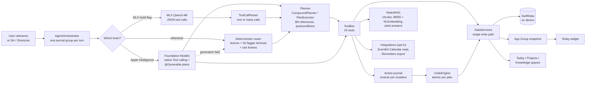

<p align="center">
  
</p>

# PocketBrains

**A private chief of staff for your tasks, projects and notes, run by an
AI agent that lives entirely on your iPhone.** Say what you need in one
thread; a 24-tool agent plans multi-step requests, acts on a local
SwiftData store, answers questions from your notes with citations, and
can undo anything it did, using Apple's on-device model, an optional open
model, or a deterministic parser when neither is available. Nothing leaves
the phone.

[](https://github.com/seanmcrae/pocketbrains-app/actions/workflows/ci.yml)


[](https://seanmcrae.github.io/pocketbrains-app/)

**Docs site:** [seanmcrae.github.io/pocketbrains-app](https://seanmcrae.github.io/pocketbrains-app/)
(overview, eval tables generated from CI, architecture, product brief,
verification checklist).

## In 60 seconds

- **Product bet:** the people who most need an AI assistant for their
  work (consultants under NDA, founders, leads juggling workstreams) are
  often the ones who cannot put that work into a cloud chatbot. iOS 26's
  on-device model makes a useful assistant possible without that trade.
- **What it does:** "create a project Launch, add 3 tasks for Friday and
  link it to brand voice" runs as a visible five-step plan; "what do my
  notes say about the venue?" answers with `[1]` citations to the source
  notes; "remind me to take out the bins every other Thursday" creates a
  recurring task; "undo that" reverts the whole last request. Each step is
  a tool call against real structured data, not a chat reply.
- **How it stays reliable:** a three-tier brain. Apple Foundation Models
  with native tool calling and guided-generation plans, an optional MLX
  build running Qwen3-4B, and a deterministic planner and router that
  always work, so the product never shows "AI unavailable". Every
  mutation is journaled with its inverse, so every action is undoable.
- **How it is measured:** a reproducible eval of 243 synthetic utterances
  runs on every CI build. The deterministic floor scores **100%
  end-to-end on canonical and multi-step phrasing** (gated) and
  **39.6% end-to-end on a held-out paraphrase split** written and frozen
  before the v0.3 router work and never used to tune it (30.2% before
  that work). That held-out number is the honest measure of the floor,
  and the gap the language-model tiers exist to close. Per-request tool
  trimming keeps the right tool in the Foundation Models brain's set for
  96.3% of all cases (90.6% held-out) while offering 8 of 24 tools at
  most; cited note answers retrieve the right note in the top 3 for 96.7%
  of 61 synthetic questions, and every citation maps to its source.
- **Product docs:** [docs/PRODUCT.md](docs/PRODUCT.md) has the problem,
  users, jobs to be done, metrics, local-versus-cloud trade-offs, decisions
  and roadmap.

<!-- Demo GIF goes here once recorded on a device:
     docs/img/demo.gif, about 15 seconds: a multi-step plan card, Undo,
     then a cited "ask your notes" answer. -->
> **Demo:** a short device recording (plan card, Undo, cited answer) will
> go here as `docs/img/demo.gif`. Screenshots are not yet in the
> repository either; see [Screenshots](#screenshots).

## Architecture



Every brain emits the same event stream (tool started, tool finished,
text snapshot, done); plans use it too, as a plan card that updates in
place plus numbered step cards, so the UI never knows which brain
answered. If a model reports itself available but fails to generate, the
orchestrator swaps to the deterministic router and answers the same
prompt. Agent, views, Siri intents and the widget feed all go through one
service layer. Details: [docs/ARCHITECTURE.md](docs/ARCHITECTURE.md).

## Why on-device

| | On-device (PocketBrains) | Cloud assistant |
|---|---|---|
| Client and personal data | Never leaves the phone | Sent to a provider |
| Works offline / Airplane Mode | Yes | No |
| Per-request cost | None, no backend | Per token |
| Reasoning headroom | Smaller model, so its job is kept small: pick a tool, fill arguments | Large models, long context |
| Device coverage | Apple Intelligence devices, plus MLX and deterministic tiers | Any connected device |

The design keeps the model's job narrow and puts the data work in
deterministic, tested code. That is what makes a ~3B on-device model
sufficient for this product.

## Features

- **One thread as home.** Natural-language capture and questions; tool
  activity renders as inline cards so every action is visible.
- **Multi-step plans.** One request becomes an ordered plan of tool calls
  with results passed between steps (a project created in step 1 is the
  one step 3 files tasks into, by id). Each step's postcondition is
  checked; the first failure stops the plan with a clear message.
- **Undo for everything the agent does.** Each mutation records its
  inverse in an on-device journal. Tap Undo on a card, or say "undo that"
  to revert the last request, a whole plan atomically.
- **Ask your notes.** Questions are answered from your own notes with
  inline `[n]` citations; tap a source chip to open the note. Hybrid
  retrieval (BM25 plus on-device sentence embeddings) over overlapping
  passages, kept incremental as notes change.
- **Recurring tasks, rescheduling, snoozing, priorities, milestones.**
  "Every other Monday", "push the report to end of month", "snooze the
  gutters for 3 days".
- **Opt-in system integrations.** Calendar context for briefs and "what's
  my afternoon look like?", export of tasks to Apple Reminders (undoable),
  both off until switched on in Settings, Integrations.
- **Siri, Shortcuts and a Today widget.** Ask PocketBrains, Add Task,
  What's Blocking a project; a widget with the brief and next tasks.
- **Spaces.** Pull the thread down and it docks while Today (ranked
  agenda), Projects (progress, blockers, milestones, activity) and
  Knowledge (an orbital constellation of linked notes) fan in. One scalar
  drives the whole transition, so it is gestural and interruptible.
- **Knowledge graph.** Typed links between notes, tasks and projects;
  new notes are linked automatically to the projects and tasks they name.
- **Semantic note search** with on-device sentence embeddings, merged
  with keyword search.
- **Rituals.** A morning brief and an evening reflection composed from
  your data; due-date notifications kept in sync with tasks.
- **Full JSON export.**
- **Deep Glass design system.** Metal shaders for SDF refraction with a
  motion-tracked specular, aurora noise for the agent's presence, and a
  per-glyph "condensation" reveal for streaming text via a custom
  `TextRenderer`. Reduce Motion freezes the living surfaces. See
  [docs/DESIGN.md](docs/DESIGN.md).
- **Privacy manifest** declaring no tracking and no collected data.

## The 24 tools

One implementation (`ToolBox`) serves all three brains: bridged to native
Foundation Models `Tool`s with `@Generable` arguments, rendered into a
JSON tool prompt for MLX, and called by the deterministic router. Every
mutating tool records its inverse in the action journal. Examples show
what each tool is for; the deterministic router's exact grammar is the
canonical split of the eval.

| Tool | What it does | Example request |
|---|---|---|
| `createTask` | Task with natural due date, priority, project, optional repeat rule | "Remind me to take out the bins every other Thursday" |
| `completeTask` | Complete a task; a recurring one spawns its next occurrence | "Finish book flights" |
| `updateTask` | Change due date, priority or project | "Move the budget draft into Q3 Planning" |
| `rescheduleTask` | New date, or a shift from the current one | "Reschedule the quarterly report to end of month" |
| `snoozeTask` | Push a task out from today | "Snooze clean the gutters for 3 days" |
| `setPriority` | Low, normal, high, urgent | "Make the quarterly report urgent" |
| `setRecurrence` | Daily, weekdays, every N weeks or days, or stop | "Make clean the gutters repeat every week" |
| `queryTasks` | Today, overdue, blocked, upcoming or all | "Which tasks are overdue?" |
| `createProject` | Create a project | "New project called Kitchen renovation" |
| `projectStatus` | Progress, blockers and what they wait on, milestones | "What's blocking the website redesign?" |
| `addMilestone` | Add a dated milestone | "Add milestone Public beta to Q3 Planning by end of month" |
| `listMilestones` | A project's milestones, soonest first | "What milestones does website redesign have?" |
| `createNote` | Capture a note; auto-link it to what it mentions | "Note: the vendor prefers invoices as PDF" |
| `appendNote` | Add text to an existing note | "Append to meeting notes: Sam will send the deck" |
| `askNotes` | Answer from your notes with `[n]` citations | "What do my notes say about the venue?" |
| `searchNotes` | Semantic plus keyword note search | "Find notes about pricing" |
| `searchEverything` | Tasks, projects and notes at once | "Search everything for invoice" |
| `notesFrom` | Notes from a given day | "Summarize my notes from yesterday" |
| `linkItems` | Typed link between any two items | "Link brand voice to website redesign" |
| `agenda` | Overdue, due today, blocked, this week | "What needs my attention today?" |
| `calendarAgenda` | Calendar events in a window plus tasks due (opt-in) | "What's my afternoon look like?" |
| `exportToReminders` | Copy tasks into Apple Reminders (opt-in, undoable) | "Export today's tasks to Reminders" |
| `recall` | Search past conversation and completed work | "When did I book flights?" |
| `undo` | Revert the last request (whole plan) or only the last action | "Undo that" |

With "Focused tool list" on (Settings, Intelligence; off by default),
the Foundation Models brain is offered only the tools `ToolSelector`
picks for each request, at most 8, always including `createTask`,
`searchEverything`, `agenda` and `undo`. See [Evaluation](#evaluation)
for how often the needed tool survives the trim.

The agent still has no delete tools, by design: a misread request or
injected note content cannot destroy data, and anything it creates or
changes can be undone.

## Evaluation

Three evals run on every CI build, inside the iOS test suite on the
simulator, and print `EVAL` lines (a human-readable table) and `EVALJSON`
lines (read by the docs site). Every corpus is **synthetic**: written for
the eval, with no real user data. Numbers below are copied from CI logs;
each column names its run. They describe the deterministic brain, the
tool trimmer and the extractive retrieval path. **No Foundation Models or
MLX accuracy is claimed**: those need Apple Intelligence hardware or the
MLX build (roadmap issue #5).

### Router (deterministic brain)

`Tests/Eval` runs each utterance through the deterministic brain's real
entry point (`IntentFallbackBackend.routeTurn`, which plans compound
requests) against a freshly seeded in-memory store. Tool accuracy: the
expected tool (for compound requests, the exact sequence). End-to-end:
right tool, every call succeeded, and the resulting state is right
(title, due date, priority, repeat rule, completion, filing, note text).

How the splits may be used:

- **Gated** (must stay at 100% end-to-end or CI fails): v1 canonical,
  v2 canonical and v2 compound (71 cases).
- **Dev** (rules may be tuned on them; misses are printed): the v1 and
  v2 paraphrase splits from earlier releases, and the new **v0.3 dev**
  split (51), the only split v0.3 tuned on.
- **Held-out** (never tuned on; misses counted, never itemized):
  **v0.3 held-out (frozen)** (53), written in one sitting and committed
  before any v0.3 router change, so its first CI run is the honest
  "before"; and **v0.2 held-out (reported)** (34), frozen as it was,
  but its score was published with v0.2, so it is a secondary signal.

Caveat: one author wrote the held-out splits, the dev split and the
rules, so the held-out numbers are less independent than real user data
would be. The dev split was written after the held-out split, in a
different register, rather than mirroring it, and frames were added only
for constructions that dev misses showed.

Results on the iPhone 17 Pro simulator, Xcode 26.6 (tool accuracy /
end-to-end). "v0.2 on main" is [run 37708520476](https://github.com/seanmcrae/pocketbrains-app/actions/runs/37708520476) (139-utterance
corpus); "Before" is [run 37721075662](https://github.com/seanmcrae/pocketbrains-app/actions/runs/37721075662), the v0.3 branch with
the new splits and no router change; "v0.3" is [run 37723402205](https://github.com/seanmcrae/pocketbrains-app/actions/runs/37723402205).

| Split | Role | n | v0.2 on main | Before | v0.3 |
|---|---|---|---|---|---|
| v1 canonical | gated | 29 | 100% / 100% | 100% / 100% | **100% / 100%** |
| v1 paraphrase | dev (v0.2) | 11 | 90.9% / 90.9% | 100% / 100% | **100% / 100%** |
| v2 canonical | gated | 30 | 100% / 100% | 100% / 100% | **100% / 100%** |
| v2 compound | gated | 12 | 100% / 100% | 100% / 100% | **100% / 100%** |
| v2 dev paraphrase | dev (v0.2) | 23 | 100% / 100% | 100% / 100% | **100% / 100%** |
| v0.2 held-out (reported) | held-out | 34 | 38.2% / 35.3% | 38.2% / 35.3% | **50.0% / 47.1%** |
| v0.3 dev paraphrase | dev (v0.3) | 51 | n/a | 5.9% / 5.9% | **100% / 100%** |
| **v0.3 held-out (frozen)** | **held-out** | 53 | n/a | 37.7% / 30.2% | **47.2% / 39.6%** |
| Original 40 (v1) | | 40 | 97.5% / 97.5% | 100% / 100% | **100% / 100%** |
| Overall | | 243 | n/a (139 then) | 58.0% / 56.0% | **81.5% / 79.4%** |

The v1 paraphrase change from "v0.2 on main" to "Before" is not a router
change. "Push send the invoice to Monday" expected `updateTask`, written
for v0.1, which had no reschedule tool. v0.2 added `rescheduleTask` for
exactly this request ("push X to a date"), and the router already chose
it and moved the task to Monday. v0.3 changes the expectation to
`rescheduleTask`, adds a check that the task lands on Monday, and records
the reason in the corpus. `updateTask` remains the tool for changing
several fields or the project at once.

Read the two kinds of rows differently. Dev rows going from 5.9% to 100%
show the rules now cover the constructions they were written for; they
say little about new phrasing. The held-out rows (30.2% to 39.6% on
v0.3, 35.3% to 47.1% on v0.2) are what the v0.3 constructions bought on
phrasing they never saw. 32 of 53 v0.3 held-out utterances still miss end
to end; that is the language-model tiers' job, and adding rules until
they pass would only move the overfit.

Routing plus tool execution latency on the CI simulator (in-memory
store), run 37723402205: p50 7.46 ms, p95 21.74 ms (run 37721075662: p50 6.22 ms,
p95 22.88 ms). Latency varies between runner instances; accuracy is
deterministic.

### Tool trimming for the Foundation Models brain

`ToolSelector` picks the tools offered to the on-device model per
request (grammar parse, lexicon verbs, cue words and dates; core tools
always in; at most k). The metric is recall@k: the share of corpus cases
whose expected tool, or every step of a compound request, is inside the
trimmed set, with all 24 tools available. It measures the trim, not the
model. The selector reuses the deterministic grammar, so gated and dev
rows are not independent of it; the held-out rows are the meaningful
ones. [Run 37723402205](https://github.com/seanmcrae/pocketbrains-app/actions/runs/37723402205):

| Split | n | recall@6 | recall@8 |
|---|---|---|---|
| Gated (v1 canonical, v2 canonical, v2 compound) | 71 | 100% | 100% |
| Dev (v1, v2 and v0.3 paraphrase) | 85 | 100% | 100% |
| v0.2 held-out (reported) | 34 | 82.4% | 88.2% |
| **v0.3 held-out (frozen)** | 53 | **86.8%** | **90.6%** |
| Overall | 243 | 94.7% | 96.3% |

At k = 8 the selector offers 6.3 tools on average (of 24), because only
tools with a positive score fill the room after the four core tools.
Whether the smaller schema improves the model's tool choice or latency is
unmeasured until an on-device run (issue #6), so the switch ships off.

### Ask your notes (retrieval and citations)

`Tests/Eval/RAGEval` asks 61 synthetic questions over a 22-note
synthetic fixture (`RAGEvalFixture`), each with one relevant note and an
answer span copied from it; several notes share vocabulary on purpose,
and 5 questions use different words from their note. Recall@k: the
relevant note is among the notes of the top k passages. Citation
faithfulness: every `[n]` in the extractive answer follows a sentence
found in a retrieved passage of note n. Span attribution: when the answer
contains the span, its `[n]` points at a passage that contains it.
[Run 37723402205](https://github.com/seanmcrae/pocketbrains-app/actions/runs/37723402205):

| Method | n | recall@1 | recall@3 | Answer contains span | Citation faithfulness | Span attribution |
|---|---|---|---|---|---|---|
| BM25 | 61 | 93.4% | 96.7% | 96.7% | 100% (130 markers) | 100% |
| Semantic, hybrid | | skipped | | | | |

Semantic and hybrid retrieval run in a separate CI step that allows the
NLEmbedding sentence asset; on the GitHub macOS runner the asset is
reported unavailable, so that step prints "skipped" instead of a number.
Faithfulness is 100% by construction (the composer attaches each `[n]` to
a sentence from note n), so the check guards against regressions rather
than showing quality; it covers the extractive answer only, not
model-written answers (issue #7). The original 12-question retrieval test
still reports recall@1 91.7%, recall@3 91.7% on the BM25 path.

## Build and run

Requirements: a Mac with Xcode 26 (iOS 26 SDK) and
[XcodeGen](https://github.com/yonaskolb/XcodeGen). The Xcode project is
generated from `project.yml` and is not committed.

```bash
brew install xcodegen
git clone https://github.com/seanmcrae/pocketbrains-app.git
cd pocketbrains-app
xcodegen generate
open PocketBrains.xcodeproj
```

Run on an iOS 26 simulator or device. On hardware with Apple Intelligence
the Foundation Models brain engages automatically; elsewhere, including
the simulator, the deterministic router answers. Settings, Intelligence
lets you force the deterministic brain. Calendar and Reminders stay off
until you enable them in Settings, Integrations. The Today widget builds
unsigned in CI; to run it on a device, sign both the app and
`PocketBrainsWidget` with your team and keep the App Group
`group.com.pocketbrains.shared` on both (declared in `project.yml`). To
build the optional MLX backend,
follow the comments in `project.yml` (adds the mlx-swift-examples package
and the `POCKETBRAINS_MLX` flag; the model is a ~2.3 GB download on first
use).

Tests, exactly as CI runs them:

```bash
xcodebuild test -project PocketBrains.xcodeproj -scheme PocketBrains \
  -destination 'platform=iOS Simulator,name=iPhone 17 Pro' \
  -parallel-testing-enabled NO CODE_SIGNING_ALLOWED=NO
```

## Tests and CI

129 Swift Testing tests in 18 suites ([run 37723402205](https://github.com/seanmcrae/pocketbrains-app/actions/runs/37723402205); v0.2:
112 in 15; v0.1: 55 in 10) cover natural-language date parsing (against
now and a fixed reference date), every `ToolBox` operation, the tool
registry and the prompted tool-call parser, planning, argument passing,
failure handling and undo, chunking, BM25 recall@k, citation mapping and
incremental indexing, EventKit mapping behind mocks, the widget snapshot,
recurrence, intent routing and the v0.3 router constructions,
`ToolSelector`, the knowledge-graph layout, the streaming text clock, a
SwiftData regression walk for iOS 26 runtime traps, and the three evals.

[CI](.github/workflows/ci.yml) runs on every pull request to `main`, every
push to `main`, and on demand: a Linux job scans the tree for
home-directory paths, credentials and large files
([scripts/check-hygiene.sh](scripts/check-hygiene.sh)) and checks that the
docs site builds; a `macos-26` job generates the project (app, Today widget
extension and tests), runs the full suite on an iPhone simulator with the
newest installed Xcode, then re-runs the RAG eval with the embedding asset
allowed. [Pages](.github/workflows/pages.yml) runs after CI succeeds on
`main`: it downloads that run's build logs and
[scripts/build_site.py](scripts/build_site.py) publishes the docs site, so
every number on it comes from a CI log.

## Limitations

- **Not released.** No App Store build, no users, no telemetry. The app
  has been run on the iOS 26 simulator; the Foundation Models path,
  including guided-generation planning, has not been verified on device in
  this repository (see [docs/VERIFICATION.md](docs/VERIFICATION.md)).
- **The deterministic floor is still rigid off-grammar.** 39.6% end to
  end on the frozen v0.3 held-out paraphrases. Compound splitting only
  happens before a command verb, and "next Tuesday" means the coming
  Tuesday.
- **Tool budget on the ~3B model.** By default Foundation Models sees 22
  tools (24 with both integrations on). Per-request trimming exists but
  ships off: its recall is measured in CI, its effect on the model is
  not, and a trimmed session does not carry multi-turn context.
- **Semantic and hybrid retrieval are unmeasured in CI**: the runner has
  no sentence-embedding asset, so only the BM25 path has numbers.
- **Integrations are untested on device.** EventKit is covered by mapping
  tests behind protocols; the permission flows, Siri phrases and the
  widget need a device or simulator run by hand. The widget needs the App
  Group capability when signed.
- **MLX is opt-in and not compiled in CI.** Its tool-call parser,
  including multi-call plans, is tested.
- **English only**, fixed type sizes (Dynamic Type mapping is pending),
  and the VoiceOver pass is incomplete.
- **Semantic search and passage embeddings** are brute-force cosine over a
  personal-scale corpus and are disabled under the test host, so tests
  cover the keyword path.
- Open engineering items are tracked in [docs/QA_REPORT.md](docs/QA_REPORT.md).

## Screenshots

Device captures are still to be added. The intended set: a multi-step
plan card mid-run, Undo on a plan card, a cited "ask your notes" answer
with source chips, the Integrations permission screen, the Today widget,
the pull-down zoom into spaces, a project dossier with blockers, the
Knowledge constellation, and the in-app privacy receipt.

## Roadmap

Now: measure the Foundation Models brain on device on the full corpus,
including both held-out splits (#5); validate tool trimming on device and
choose its default (#6); a hand-labelled faithfulness set for
model-written cited answers (#7). Next: Dynamic Type and VoiceOver (#8),
an interactive widget (#9), the blocker lookup (#10). Details in
[ROADMAP.md](ROADMAP.md); product reasoning and success metrics in
[docs/PRODUCT.md](docs/PRODUCT.md).

## Repository layout

```
Sources/
  App/            entry point, app model, thread/spaces shell, App Intents
  Agent/          ToolBox, registry, orchestrator, undo, dates, briefs
    Planner/      CompoundPlanner, PlanExecutor, plan model
    Router/       IntentGrammar, CommandFrames, ParaphraseFrames, Lexicon, ToolSelector
  Intelligence/   ModelBackend protocol, Foundation Models / MLX / fallback, embeddings
    Retrieval/    NoteChunker, BM25, NotesRAG (cited answers)
  Integrations/   EventKit bridge behind protocols, widget snapshot publisher
  Data/           SwiftData models, journal, recurrence, services (single write path), store
  DesignSystem/   tokens, Deep Glass material, components, haptics, motion light
  Shaders/        LiquidGlass.metal: glass, aurora, specular sweep
  Features/       Thread, Today, Projects, Knowledge, Spaces, Settings, Privacy
Shared/           code compiled into both the app and the widget (WidgetSnapshot)
Widget/           Today widget extension (WidgetKit)
Tests/            unit tests; Eval/ holds the synthetic corpora (router splits, RAG fixture) and evals
docs/             PRODUCT, ARCHITECTURE, DESIGN, VERIFICATION, LAUNCH, QA_REPORT
  site/           docs-site templates and pinned Python requirements
scripts/          hygiene check, dev helpers, build_site.py (docs site from CI logs)
```

## Contributing and security

See [CONTRIBUTING.md](CONTRIBUTING.md), [SECURITY.md](SECURITY.md) and [ROADMAP.md](ROADMAP.md).
Changes are logged in [CHANGELOG.md](CHANGELOG.md).

## License

No license has been chosen yet, so all rights are reserved by default and
the code is published for review only. PocketBrains is intended as a
commercial app; a license will be added once that decision is made.

Built by [Sean McRae](https://github.com/seanmcrae).
