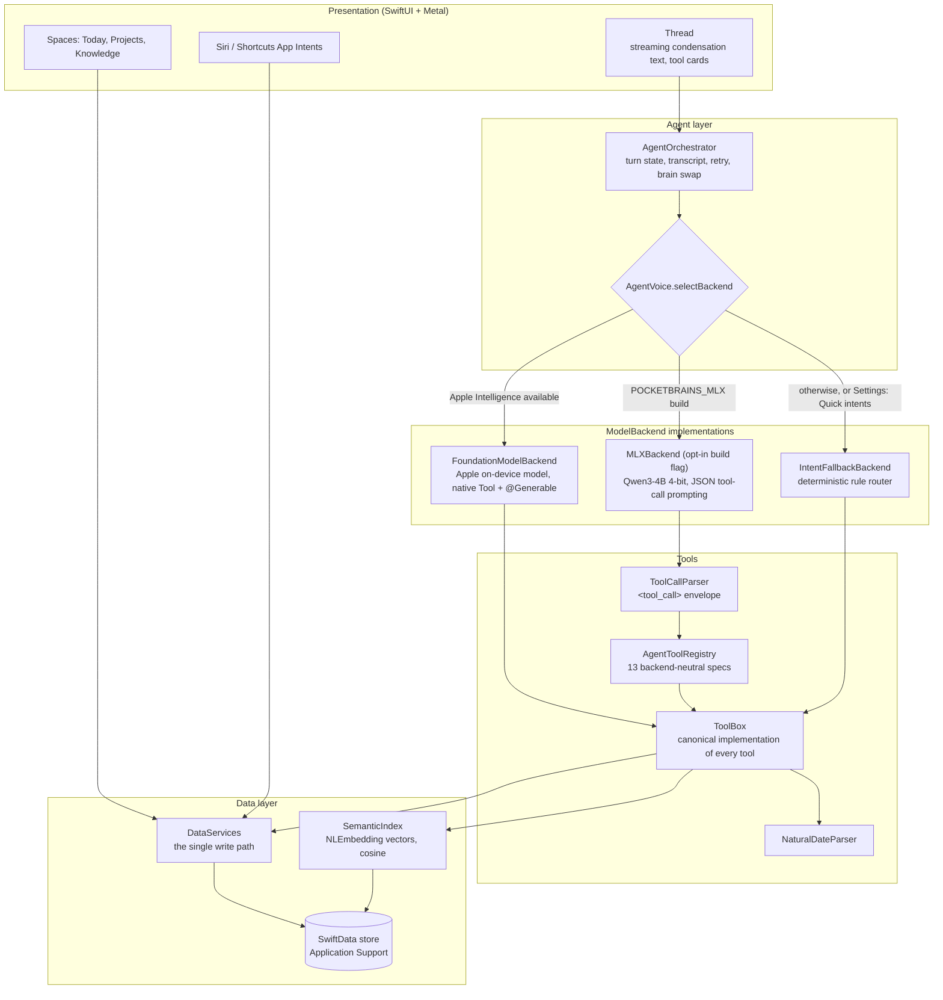

# PocketBrains: Architecture

One conversational surface, real structured data underneath, all
intelligence on the device. This document describes the code as it is on
`main`; where something is planned rather than built, it says so.

## System overview



## Layers

| Layer | Path | Responsibility |
|---|---|---|
| App | `Sources/App` | Entry point, `AppModel` (one `zoom` scalar drives the thread/spaces transition), `RootShell`, App Intents |
| Agent | `Sources/Agent` | `AgentOrchestrator`, `ToolBox`, `AgentToolRegistry`, `ToolCallParser`, `NaturalDateParser`, `BriefEngine` (morning brief and evening reflection) |
| Intelligence | `Sources/Intelligence` | `ModelBackend` protocol, the three backends, `SemanticIndex` |
| Data | `Sources/Data` | SwiftData models, `DataServices`, `Store` bootstrap and migration-failure handling, `SearchEngine`, `NotificationPlanner`, JSON `Exporter`, first-run `SeedData` |
| Design system | `Sources/DesignSystem`, `Sources/Shaders` | Tokens (theme, type, motion, layout), `GlassSurface`, components, haptics, `LiquidGlass.metal` |
| Features | `Sources/Features` | Thread, Today, Projects, Knowledge, Spaces search overlay, Settings, Privacy story and onboarding |

## The agent loop

`ModelBackend` is a small `@MainActor` protocol:

```swift
protocol ModelBackend {
    var displayName: String { get }
    func reply(to prompt: String) -> AsyncThrowingStream<AgentEvent, Error>
    func resetConversation()
}

enum AgentEvent {
    case toolStarted(name: String, summary: String)
    case toolFinished(ToolEventRecord)
    case text(String)          // cumulative snapshot, not a delta
    case done(finalText: String)
}
```

Every backend speaks this event language, so the thread UI does not know
which brain answered. A turn in `AgentOrchestrator`:

1. Persist the user's `ChatMessage`, set phase `.thinking`.
2. Iterate the backend's stream. `toolStarted` / `toolFinished` become
   inline tool cards (phase `.acting`); `text` snapshots drive the
   condensation renderer (phase `.streaming`); `done` persists the agent
   message with its tool records.
3. **Brain swap on failure.** If the stream throws before any text arrived
   and the active brain is not the fallback, the orchestrator replaces it
   with `IntentFallbackBackend` and re-runs the same prompt once. This
   covers the case where a model reports itself available but cannot
   generate (for example, Apple Intelligence enabled with assets not yet
   downloaded). If that also fails, the turn ends with a retryable message.
4. `retryLast()` re-runs the last prompt without re-posting the bubble.

### Backend selection

`AgentVoice.selectBackend` runs at launch and when the Settings preference
changes:

| Order | Backend | When | Tool calling |
|---|---|---|---|
| 1 | `FoundationModelBackend` | `SystemLanguageModel.default.availability == .available` and preference is Automatic | Native `Tool` conformances with `@Generable` argument structs; streamed snapshots |
| 2 | `MLXBackend` | Compiled only with `-D POCKETBRAINS_MLX` plus the mlx-swift-examples package | System prompt lists the registry as JSON; the model replies with a `<tool_call>` envelope; `ToolCallParser` extracts it; up to 4 tool hops per turn |
| 3 | `IntentFallbackBackend` | Always available; forced by Settings, Quick intents | Rule-based router maps the utterance straight to one `ToolBox` call; reply is templated and streamed word by word so the UI behaves identically |

All three share `AgentVoice.instructions()` so the voice is consistent.

### Tools

`ToolBox` is the one implementation of every capability. The Foundation
Models bridge (`FoundationModelBackend.swift`), the registry used by MLX,
and the fallback router all call into it, and it calls into
`DataServices`. Every tool returns a `ToolResult` with a one-line `summary`
for the card, a `detail` the model reads, and `succeeded`.

| Tool | Arguments (required in bold) | Effect |
|---|---|---|
| `createTask` | **title**, due, priority, project | Creates a task; due parsed by `NaturalDateParser`; priority `low/normal/high/urgent` (`critical` maps to urgent) |
| `completeTask` | **query** | Marks the first task whose title matches as done |
| `updateTask` | **query**, due, priority, project | Reschedules, reprioritises or moves a task; reports "no changes" honestly |
| `queryTasks` | **filter**, project | `today`, `overdue`, `blocked`, `upcoming` (7 days) or `all`, optionally per project |
| `createProject` | **name**, summary | Creates a project with an identity hue |
| `projectStatus` | **name** | Progress, blockers and what they wait on, next milestones, recent activity |
| `addMilestone` | **project**, **title**, target | Adds a dated milestone |
| `createNote` | **title**, **body**, project | Captures a note, indexes it, and auto-weaves links to projects and tasks it mentions |
| `searchNotes` | **query** | Semantic plus keyword search, merged and de-duplicated |
| `notesFrom` | **day** | Full text of notes created or edited on a day |
| `linkItems` | **from**, **to**, relation | Typed knowledge-graph edge between any two notes, tasks or projects |
| `agenda` | none | Overdue, due today, blocked, and this week |
| `recall` | **query** | Searches past conversation and completed work |

`ToolBox.appendNote` exists but is not yet exposed as a tool (see the
roadmap in `docs/PRODUCT.md`).

### Deterministic fallback router

`IntentFallbackBackend.routeIntent` is an ordered list of rules over the
lowercased utterance: explicit capture commands first (remind me, add a
task, todo, I need to, note, jot), then completion, agenda, blockers and
status, summaries, links, search, recall, and new projects. Anything
unmatched gets the agenda plus an honest explanation that the device is in
quick-intent mode. Argument extraction strips the command prefix and the
date phrase from titles, using distance-based slicing so `String.Index`
values never cross string instances.

The router is measured by an eval in `Tests/Eval` (synthetic corpus,
results in the README).

## Data layer

SwiftData models: `TaskItem` (named to avoid Swift Concurrency's `Task`),
`Project`, `Milestone`, `Note`, `KnowledgeLink` (typed edge between any
two entities), `ChatMessage` (persistent transcript with tool records),
and `EmbeddingRecord` (vector cache keyed by a stable content hash).

Several shapes are deliberate workarounds for traps found on the iOS 26
runtime during CI: task dependencies are stored as packed UUID `Data`
rather than a self-referential relationship, note tags as a joined string
rather than `[String]`, and explicit relationship inverses are omitted.
`docs/VERIFICATION.md` records the investigation.

`DataServices` groups small synchronous services (`TaskService`,
`ProjectService`, `NoteService`, `GraphService`). Agent tools, views and
App Intents all write through them, so an agent action shows up in Today,
Projects and Knowledge immediately, and vice versa.

`Store.makeContainer` creates Application Support before opening the
store. If the persistent store cannot be opened (for example, a failed
migration), it backs up the store files with a timestamped suffix, records
`Store.migrationError`, and falls back to an in-memory store instead of
crashing.

`SemanticIndex` uses `NLEmbedding.sentenceEmbedding(for: .english)`,
caches vectors in `EmbeddingRecord`, and ranks by cosine similarity in
memory. That is sized for a personal corpus of thousands of notes; there
is no approximate-nearest-neighbour index. The embedder is disabled under
the test host, so tests exercise keyword search only.

## Presentation and design system

- **RootShell**: the thread is home. A vertical pull scrubs `AppModel.zoom`;
  the thread recedes into a glass dock while Today, Projects and Knowledge
  fan in. One scalar drives every property, so the transition is
  interruptible and cannot desynchronise.
- **Thread**: a custom `TextRenderer` (`CondensationRenderer`) reveals each
  glyph from blurred to sharp as it arrives, timed by `ChunkClock`; tool
  activity renders as inline glass cards; thinking is an aurora orb.
- **Knowledge**: `OrbitalLayout` places the focused node at the centre and
  others on rings by graph distance, animated by `GraphSimulation`.
- **Deep Glass**: `LiquidGlass.metal` provides three stitchable shaders
  applied with SwiftUI `layerEffect`: `liquidGlass` (rounded-rect SDF
  refraction, motion-tracked specular, identity tint), `aurora`
  (domain-warped noise) and `specularSweep` (the streaming highlight).
  `GlassSurface` falls back to a plain material if shaders are unavailable;
  Reduce Motion freezes the living surfaces. Token rules live in
  `docs/DESIGN.md`.

## Testing and CI

- Swift Testing suites in `Tests/`: date parsing (relative to now and to a
  fixed reference date), `ToolBox`, the tool registry and tool-call parser,
  the intent router, orbital layout, the streaming chunk clock, a SwiftData
  insert-walk regression suite, and the router eval.
- Tests run serialized with a per-suite time limit. Each test keeps its
  in-memory `ModelContainer` alive explicitly, because a `ModelContext`
  does not retain its container.
- The test host is inert: no Metal, CoreMotion or persistent store.
- `.github/workflows/ci.yml` runs on every pull request and push to `main`:
  a Linux hygiene scan, then XcodeGen and `xcodebuild test` on the newest
  Xcode on a `macos-26` runner against an iPhone simulator. The job summary
  shows the test count and the eval table.

What CI cannot cover: the Foundation Models path needs an Apple
Intelligence device, and the MLX path is not compiled in CI. Both are
checked by hand using `docs/VERIFICATION.md`.
