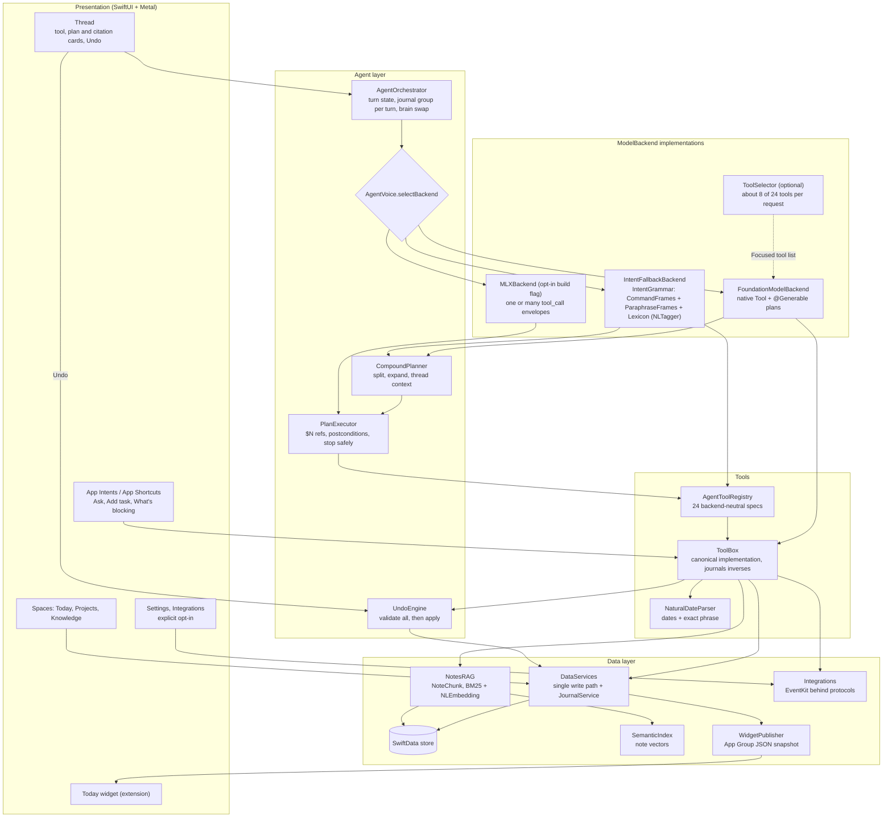

# PocketBrains: Architecture

One conversational surface, real structured data underneath, all
intelligence on the device. This document describes the code as it is on
`main`; where something is planned rather than built, it says so.

## System overview



## Layers

| Layer | Path | Responsibility |
|---|---|---|
| App | `Sources/App` | Entry point, `AppModel` (one `zoom` scalar drives the thread/spaces transition), `RootShell`, App Intents |
| Agent | `Sources/Agent` | `AgentOrchestrator`, `ToolBox`, `AgentToolRegistry`, `ToolCallParser`, `UndoEngine`, `NaturalDateParser`, `BriefEngine`; `Planner/` (`CompoundPlanner`, `PlanExecutor`, `AgentPlan`); `Router/` (`IntentGrammar`, `CommandFrames`, `ParaphraseFrames`, `Lexicon`, `ToolSelector`) |
| Intelligence | `Sources/Intelligence` | `ModelBackend` protocol, the three backends, `SemanticIndex`; `Retrieval/` (`NoteChunker`, `BM25Index`, `NotesRAG`, `CitedAnswerComposer`) |
| Integrations | `Sources/Integrations` | `CalendarReading` / `RemindersWriting` protocols, `EventKitCalendar` / `EventKitReminders`, `AgendaComposer`, `ReminderMapper`, `WidgetPublisher` |
| Data | `Sources/Data` | SwiftData models (including `JournalEntry`, `NoteChunk`, `RecurrenceRule`, `ReminderExport`), `DataServices`, `Store`, `SearchEngine`, `NotificationPlanner`, JSON `Exporter`, `SeedData` |
| Shared and widget | `Shared`, `Widget` | `WidgetSnapshot` (compiled into both targets) and the WidgetKit extension |
| Design system | `Sources/DesignSystem`, `Sources/Shaders` | Tokens (theme, type, motion, layout), `GlassSurface`, components, haptics, `LiquidGlass.metal` |
| Features | `Sources/Features` | Thread, Today, Projects, Knowledge, Spaces search overlay, Settings, Privacy story and onboarding |

## The agent loop

`ModelBackend` is a small `@MainActor` protocol:

```swift
protocol ModelBackend {
    var displayName: String { get }
    func reply(to prompt: String) -> AsyncThrowingStream<AgentEvent, Error>
    func resetConversation()
}

enum AgentEvent {
    case toolStarted(name: String, summary: String)
    case toolFinished(ToolEventRecord)
    case text(String)          // cumulative snapshot, not a delta
    case done(finalText: String)
}
```

Every backend speaks this event language, so the thread UI does not know
which brain answered. A turn in `AgentOrchestrator`:

1. Persist the user's `ChatMessage`, set phase `.thinking`.
2. Iterate the backend's stream. `toolStarted` / `toolFinished` become
   inline tool cards (phase `.acting`); `text` snapshots drive the
   condensation renderer (phase `.streaming`); `done` persists the agent
   message with its tool records.
3. **Brain swap on failure.** If the stream throws before any text arrived
   and the active brain is not the fallback, the orchestrator replaces it
   with `IntentFallbackBackend` and re-runs the same prompt once. This
   covers the case where a model reports itself available but cannot
   generate (for example, Apple Intelligence enabled with assets not yet
   downloaded). If that also fails, the turn ends with a retryable message.
4. `retryLast()` re-runs the last prompt without re-posting the bubble.
5. **Journal group.** Before each turn the orchestrator sets
   `ToolBox.turnGroupID` to a fresh id, so every mutation in the turn
   (one tool call, a native multi-turn tool sequence, or a whole plan) is
   journaled under one group and "undo that" reverts all of it. Cards are
   matched by record id, so a plan card can update in place.

### Backend selection

`AgentVoice.selectBackend` runs at launch and when the Settings preference
changes:

| Order | Backend | When | Tool calling |
|---|---|---|---|
| 1 | `FoundationModelBackend` | `SystemLanguageModel.default.availability == .available` and preference is Automatic | Native `Tool` conformances with `@Generable` argument structs; streamed snapshots; optionally only the tools `ToolSelector` picks for the request |
| 2 | `MLXBackend` | Compiled only with `-D POCKETBRAINS_MLX` plus the mlx-swift-examples package | System prompt lists the registry as JSON; the model replies with a `<tool_call>` envelope; `ToolCallParser` extracts it; up to 4 tool hops per turn |
| 3 | `IntentFallbackBackend` | Always available; forced by Settings, Quick intents | `routeTurn`: compound requests become a plan (`CompoundPlanner` then `PlanExecutor`); single ones go through `IntentGrammar` to one registry call. Replies are templated and streamed word by word so the UI behaves identically |

### Per-request tool trimming (Foundation Models)

The on-device model is offered every tool's schema on every request: 22
tools, or 24 with both integrations on. With Settings, Intelligence,
"Focused tool list" switched on (`ToolTrimming`, off by default),
`FoundationModelBackend` builds a one-request session that offers only
the tools `ToolSelector` picks:

1. The deterministic grammar's own reading of the request scores
   highest: the tool `IntentGrammar.parse` returns, each step of a
   `CompoundPlanner` plan, then the parse's fallbacks.
2. Lexicon verbs (by lemma) vote for their action's tools; for example a
   reschedule verb votes for `rescheduleTask` and `updateTask`.
3. Cue words vote for the tools they usually mean ("milestone",
   "overdue", "according to", "calendar", "reminders").
4. A date phrase votes for the date-taking tools.

`createTask`, `searchEverything`, `agenda` and `undo` are always offered,
so a poor trim can still capture, search, answer with the agenda or undo.
At most 8 tools are offered (the default limit); only tools with a
positive score fill the room after the core, so simple requests often get
fewer. Ties break by registry order, so a request always gets the same
set, and tools the user has not opted into are never offered. Trade-off:
the trimmed session is fresh per request, so it does not carry
multi-turn context; compound requests still plan with the full catalog.
The eval measures recall@k of the trim (is the expected tool, or every
step of a compound request, inside the set); it does not measure what the
model then does with it.

### Multi-step planning

A plan is an ordered list of `PlanStep(tool, arguments)`. Argument values
may reference earlier steps: `$2` is step 2's exact reference
(`id:<uuid>` of what it created), `$2.title` any named output, `$last` the
most recent step that produced a reference. Every service
`find(matching:)` resolves `id:` references before fuzzy title matching,
so a project created in step 1 is the one tasks are filed into, even when
a similarly named project exists.

Where plans come from:

- **Deterministic:** `CompoundPlanner.split` cuts on ", and then", ", then",
  " and ", commas and semicolons, but only where the next words open a
  command (a verb from a fixed list), so "call mum and dad" stays one task.
  Each clause is parsed by `IntentGrammar`; "add 3 tasks…" and "add tasks:
  a, b and c" expand to one step per task; tasks after a `createProject`
  are filed under it; pronouns resolve to the item the request is about.
  A clause nothing recognizes cancels planning (the request stays single).
- **Foundation Models:** when a request splits into more than one clause,
  a tool-less planning session generates a `@Generable` `GeneratedPlan`
  (steps of tool name plus name/value arguments, `$N` references allowed).
  Unknown tool names reject the plan; the deterministic planner is the
  fallback. After execution a separate tool-less session narrates the
  outcome, so narration can never re-run a tool. Requests that do not
  split use native multi-turn tool calling; those calls are numbered as
  steps on their cards.
- **MLX:** several `<tool_call>` envelopes in one reply
  (`ToolCallParser.parseAll`) run as a plan.

`PlanExecutor.execute` resolves references, runs each step through the
registry, and checks a postcondition (the created task exists and is in
the requested project, the completed task is done, the link exists, and so
on). The first failed step stops the plan; if that step had written
something before failing its postcondition, its own journal entry is
reverted first. Remaining steps are marked skipped. The user sees a
message naming the step and the problem, and whether earlier steps are in
place (and undoable) or nothing changed. Events: a `plan` card with the
numbered outline, `toolStarted`/`toolFinished` per step with a "2/5"
label, and the final plan card (same id) with ✓ / ✗ / – marks and an
`undoGroup`.

### Action journal and undo

Every mutating `ToolBox` method records a `JournalEntry` (tool, summary,
group, encoded `[InverseStep]`): delete what was created, reopen what was
completed, restore a task snapshot after an update, restore a note body
after an append, delete a link, move a repeat rule back, remove an
exported reminder. `UndoEngine` reverts one entry, a group, or "the last
turn" (`undo` tool, scope `turn` or `step`). It validates every inverse
before applying any, so a group either reverts completely or not at all
(for example, if a task was deleted behind the journal's back, its restore
cannot apply and nothing changes). Deleting something already gone counts
as done. Undo of a recurring task's completion moves the rule back to the
original and deletes the spawned occurrence.

### Ask your notes (cited retrieval)

- `NoteChunker` splits a note into sentence-bounded passages of about 80
  words (NLTokenizer), each repeating the previous passage's last sentence.
- `NotesRAG` stores them as `NoteChunk` rows with an NLEmbedding sentence
  vector when the asset exists. `sync(notes:)` re-cuts only notes whose
  content hash changed and drops chunks of deleted notes; it runs before
  every question, so edits from the note editor, undo or the agent are
  always reflected. `upsert` runs immediately after agent writes.
- Ranking fuses BM25 over title plus passage tokens (stemmed, stopwords
  removed) with cosine similarity by reciprocal rank (k = 60); candidates
  need a positive keyword score or a cosine above 0.45.
- `CitedAnswerComposer` picks the passages' sentences that best overlap
  the question and numbers sources by first use, one number per note. The
  deterministic brain shows that extractive answer; the model brains get
  the same numbered passages with the instruction to answer only from them
  and cite `[n]`. Citations travel on the tool record and render as chips
  that open the note.

### System integrations (opt-in)

EventKit is confined to `EventKitBridge.swift` behind `CalendarReading`
and `RemindersWriting`, created lazily on first opt-in use. `Integrations`
answers "ready" only when the Settings switch is on and iOS has granted
full access. `calendarAgenda` reads events for a `DayWindow` ("this
afternoon" starts now if the afternoon is under way) and adds free
stretches and tasks due; `AgendaComposer` and `ReminderMapper` are the
pure, tested mapping. `exportToReminders` records each export in
`ReminderExport` so a task is never exported twice and undo deletes
exactly those reminders. Foundation Models is offered the two tools only
after opt-in. The Morning Brief shows a calendar line when ready.

### App Intents and widget

`IntentRuntime` holds one `ToolBox` on the shared container, so Siri
actions are journaled like thread actions. Shortcuts: Ask PocketBrains
(runs the selected brain, falls back to the deterministic one), Add Task,
What's Blocking `<project>` (a `ProjectEntity` with a string query), and
Capture Note. `WidgetPublisher` writes a JSON `WidgetSnapshot` (brief
headline, counts, next tasks) into the App Group container after every
task mutation and reloads the timeline; the widget extension only reads
that file. Without the App Group entitlement (unsigned builds) publishing
is skipped and the widget shows its placeholder.

All three share `AgentVoice.instructions()` so the voice is consistent.

### Tools

`ToolBox` is the one implementation of every capability. The Foundation
Models bridge (`FoundationModelBackend.swift`), the registry used by MLX,
and the fallback router all call into it, and it calls into
`DataServices`. Every tool returns a `ToolResult` with a one-line `summary`
for the card, a `detail` the model reads, and `succeeded`.

| Tool | Arguments (required in bold) | Effect |
|---|---|---|
| `createTask` | **title**, due, priority, project, repeats | Creates a task; due parsed by `NaturalDateParser`; a repeat rule attaches a `RecurrenceRule` and sets the first due date |
| `completeTask` | **query** | Marks a task done; a recurring task spawns its next occurrence |
| `updateTask` | **query**, due, priority, project | Reschedules, reprioritises or moves a task; reports "no changes" honestly |
| `rescheduleTask` | **query**, to, by | New absolute date, or a shift from the current due date |
| `snoozeTask` | **query**, until | From today: tomorrow by default, "3 days", "until Monday" |
| `setPriority` | **query**, **priority** | Strict parse; unknown words fail instead of guessing |
| `setRecurrence` | **query**, **rule** | Daily, weekdays, every N weeks or days, or "none" |
| `queryTasks` | **filter**, project | `today`, `overdue`, `blocked`, `upcoming` (7 days) or `all` |
| `createProject` | **name**, summary | Creates a project with an identity hue |
| `projectStatus` | **name** | Progress, blockers and what they wait on, next milestones, recent activity |
| `addMilestone` | **project**, **title**, target | Adds a dated milestone |
| `listMilestones` | **project** | Milestones, soonest first, with reached marks |
| `createNote` | **title**, **body**, project | Captures and indexes a note, auto-weaves links |
| `appendNote` | **query**, **text** | Appends to a note and re-indexes it |
| `askNotes` | **question** | Retrieves passages and answers with `[n]` citations |
| `searchNotes` | **query** | Semantic plus keyword note search |
| `searchEverything` | **query** | Tasks, projects and notes in one query |
| `notesFrom` | **day** | Full text of notes created or edited on a day |
| `linkItems` | **from**, **to**, relation | Typed knowledge-graph edge |
| `agenda` | none | Overdue, due today, blocked, and this week |
| `calendarAgenda` | window | Opt-in: events, free stretches and tasks due in a day window |
| `exportToReminders` | scope | Opt-in: copies tasks to Apple Reminders, idempotent and undoable |
| `recall` | **query** | Searches past conversation and completed work |
| `undo` | scope | Reverts the last turn (whole plan) or only the last action |

Task and project lookup try a verbatim title match first, then fall back
to stemmed content-word overlap (every query word, or all but one for
queries of three or more words), preferring open tasks.

### Deterministic fallback router

`IntentGrammar.parse` turns a clause into a `ParsedIntent` (tool,
arguments, optional fallbacks) without executing it, so the planner can
build and show a plan first. Order:

1. `CommandFrames.beforeCapture`: phrasings the capture rules would
   mis-read ("remind me about X later" is a snooze; "every Friday I need
   to…" is a recurring task).
2. The v0.1 capture rules (remind me, add a task, todo, I need to, note,
   jot), now cutting a repeat phrase (`Recurrence.phrase`) and the exact
   date phrase (`NaturalDateParser.match`) out of titles.
3. Undo.
4. `CommandFrames.commands`: a slot grammar over the lowercased clause
   for the v0.2 tools (reschedule, snooze, priority, recurrence,
   milestones, append, search everything) and common rewordings of v0.1
   intents (done with X, how is X going, add X to my list). Slot values
   are cut from the original text by offset, so capitalization survives.
5. The v0.1 rules: ask your notes, calendar, Reminders export, agenda,
   blockers and status, completion, summaries, links, search, recall, new
   projects.
6. `CommandFrames.paraphrase`: tokens and lemmas from NLTagger (`.lemma`,
   `.lexicalClass`; a rule-based lemmatizer covers missing assets); the
   first verb whose lemma is in the `Lexicon` synonym sets decides the
   intent and the slots around it are filled the same way.
7. `CommandFrames.questionFallback` (v0.3): a factual wh-question nothing
   else claimed goes to `askNotes`; one scoped to today or this week goes
   to the agenda.
8. Otherwise the agenda, with an honest note about quick-intent mode.

v0.3 adds `ParaphraseFrames` (constructions rather than sentences),
tuned only against the v0.3 dev split. Leading interjections ("Wait,",
"Not now,") are dropped first. Early frames, before the capture rules:
"remind me what/who…" is a question, "remind me about X tomorrow" moves an
existing task (or captures it if there is none), "ping me tomorrow to X",
a reminder asked for as a noun ("can I get a reminder to…"), and labelled
captures ("Task: …", "Idea: …", "keep in mind…"). Command frames, before
the v0.2 ones: statements of state ("the gutters are clean", "that's the
passport sorted", "X is really important", "X isn't a priority", "X is now
due Monday", "X comes round every 4 weeks"), subject-first requests ("can
the invoice slip to Thursday"), a shift without a preposition ("kick the
report out a couple of days"), past-tense reports ("paid the water bill"
completes "pay the water bill"), quoted text placed into a named note,
verbless project status ("Q3 planning progress?"), list states ("still
open", "stuck"), and searches over everything or over notes. The
Reminders export check moved ahead of the command frames so "push today's
list to Apple Reminders" is not read as a reschedule, and "do" left the
completion lexicon because, as an auxiliary, it turned questions into
completions.

`NaturalDateParser` covers relative days, weekdays (full, abbreviated,
"next"/"this"/"every other"), "in N days/weeks/months", "in a fortnight",
period ends, weekends, explicit dates (NSDataDetector) and a time of day.

The router is measured by the eval in `Tests/Eval` (243 synthetic
utterances in eight splits, including two frozen held-out paraphrase
splits whose misses are never itemized; results in the README).
Canonical and compound phrasing is gated at 100%.

## Data layer

SwiftData models: `TaskItem` (named to avoid Swift Concurrency's `Task`),
`Project`, `Milestone`, `Note`, `KnowledgeLink` (typed edge between any
two entities), `ChatMessage` (persistent transcript with tool records),
`EmbeddingRecord` (vector cache keyed by a stable content hash), and in
v0.2 `JournalEntry` (inverse operations per mutation), `NoteChunk`
(retrieval passages), `RecurrenceRule` and `ReminderExport`. The v0.2
models are new entities rather than new attributes on existing ones, so
existing stores migrate by adding tables, and they use only attribute
types proven on the iOS 26 runtime (String, Int, Date, Date?, Data,
unique UUID); `AAStoreDiagnostics` inserts a journal entry to keep that
checked.

Several shapes are deliberate workarounds for traps found on the iOS 26
runtime during CI: task dependencies are stored as packed UUID `Data`
rather than a self-referential relationship, note tags as a joined string
rather than `[String]`, and explicit relationship inverses are omitted.
`docs/VERIFICATION.md` records the investigation.

`DataServices` groups small synchronous services (`TaskService`,
`ProjectService`, `NoteService`, `GraphService`, `JournalService`). Agent tools, views and
App Intents all write through them, so an agent action shows up in Today,
Projects and Knowledge immediately, and vice versa.

`Store.makeContainer` creates Application Support before opening the
store. If the persistent store cannot be opened (for example, a failed
migration), it backs up the store files with a timestamped suffix, records
`Store.migrationError`, and falls back to an in-memory store instead of
crashing.

`SemanticIndex` uses `NLEmbedding.sentenceEmbedding(for: .english)`,
caches vectors in `EmbeddingRecord`, and ranks by cosine similarity in
memory. That is sized for a personal corpus of thousands of notes; there
is no approximate-nearest-neighbour index. The embedder is disabled under
the test host, so tests exercise keyword search only.

## Presentation and design system

- **RootShell**: the thread is home. A vertical pull scrubs `AppModel.zoom`;
  the thread recedes into a glass dock while Today, Projects and Knowledge
  fan in. One scalar drives every property, so the transition is
  interruptible and cannot desynchronise.
- **Thread**: a custom `TextRenderer` (`CondensationRenderer`) reveals each
  glyph from blurred to sharp as it arrives, timed by `ChunkClock`; tool
  activity renders as inline glass cards; thinking is an aurora orb.
- **Knowledge**: `OrbitalLayout` places the focused node at the centre and
  others on rings by graph distance, animated by `GraphSimulation`.
- **Deep Glass**: `LiquidGlass.metal` provides three stitchable shaders
  applied with SwiftUI `layerEffect`: `liquidGlass` (rounded-rect SDF
  refraction, motion-tracked specular, identity tint), `aurora`
  (domain-warped noise) and `specularSweep` (the streaming highlight).
  `GlassSurface` falls back to a plain material if shaders are unavailable;
  Reduce Motion freezes the living surfaces. Token rules live in
  `docs/DESIGN.md`.

## Testing and CI

- Swift Testing suites in `Tests/` (129 tests in 18 suites in v0.3): date
  parsing (relative to now and to a fixed reference date), `ToolBox` and
  the new tools, the tool registry and tool-call parser, planning,
  argument passing, failure handling and undo, retrieval (chunking, BM25
  recall@k, citation mapping, incremental index), integrations behind
  mocks and the widget snapshot, the intent router, orbital layout, the
  streaming chunk clock, a SwiftData insert-walk regression suite, the
  router eval, the tool-trimming recall eval, the v0.3 router constructions,
  and the "ask your notes" eval (61 synthetic questions over 22 synthetic
  notes: recall@1 and @3, answer-span hit rate, citation faithfulness and
  span attribution).
- Tests run serialized with a per-suite time limit. Each test keeps its
  in-memory `ModelContainer` alive explicitly, because a `ModelContext`
  does not retain its container.
- The test host is inert: no Metal, CoreMotion or persistent store.
- `.github/workflows/ci.yml` runs on every pull request and push to `main`:
  a Linux hygiene scan, then XcodeGen and `xcodebuild test` on the newest
  Xcode on a `macos-26` runner against an iPhone simulator. The job summary
  shows the test count and the eval table. A second step re-runs only
  the RAG eval with the sentence-embedding asset allowed
  (`PB_EMBEDDING_EVAL=1`, `continue-on-error`), so semantic and hybrid
  retrieval are measured when the runner has the asset and reported as
  skipped when it does not.
- Every eval prints `EVALJSON` lines. `.github/workflows/pages.yml` runs
  after a successful CI run on `main`, downloads that run's build logs, and
  `scripts/build_site.py` renders the docs site (overview, eval tables,
  architecture, product brief, verification) to the `gh-pages` branch. The
  site never contains a hand-typed number.

What CI cannot cover: the Foundation Models path (including guided-
generation planning and grounded answers) needs an Apple Intelligence
device; the MLX path is not compiled in CI; EventKit permission flows,
Siri phrases and the widget on a home screen need a manual run. CI does
build and embed the widget extension. Manual checks are listed in
`docs/VERIFICATION.md`.
